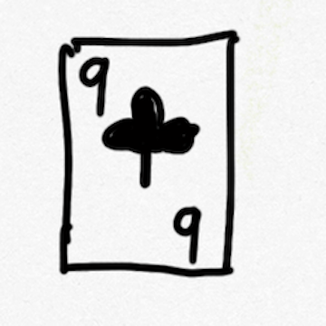

# bili_22914509123

# 表情一览

|ID|名称|表情|源地址|修改时间|
|----|----|----|----|----|
|10075|[UPOWER_1437849928_竹子]||[链接](http://i0.hdslb.com/bfs/garb/51783fc975ce9dcb7bf2ec9132feddb08a3eacec.png)|2022-10-28 20:07:04|
|10076|[UPOWER_1437849928_鲸鱼]||[链接](http://i0.hdslb.com/bfs/garb/02902112ad8910da03e03ff81a332db6b3806167.png)|2022-10-28 20:07:04|
|10077|[UPOWER_1437849928_叶子]||[链接](http://i0.hdslb.com/bfs/garb/230b3657b382ca3d8fa1b2da9c7836a65ad7d2ce.png)|2022-10-28 20:07:04|
|10078|[UPOWER_1437849928_握手]||[链接](http://i0.hdslb.com/bfs/garb/729a85566eca1b61feaa7a950f21896302cc8ec0.png)|2022-10-28 20:07:04|

# 原始数据

[跳转](./raw.json)

