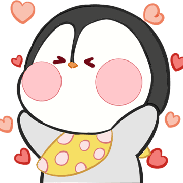

# 冬季小企鹅

# 表情一览

|ID|名称|表情|源地址|修改时间|
|----|----|----|----|----|
|11075|[冬季小企鹅_奥利给]||[链接](https://i0.hdslb.com/bfs/emote/517540166dab982d2b6820ff4d2b410457d06083.png)|2022-11-28 11:51:15|
|11076|[冬季小企鹅_比心]||[链接](https://i0.hdslb.com/bfs/emote/9d2053d58a35efc9676bbe481ed77f32c83aa758.png)|2022-12-02 16:08:31|
|11077|[冬季小企鹅_单板滑雪]||[链接](https://i0.hdslb.com/bfs/emote/399b2330d59f70e4284edf0632b0acf21b80dd36.png)|2022-12-02 16:08:31|
|11078|[冬季小企鹅_堆雪人]||[链接](https://i0.hdslb.com/bfs/emote/d59d7f667a1d76ba6e9f9e953037049b505416ae.png)|2022-12-02 16:08:31|
|11079|[冬季小企鹅_干饭准备]||[链接](https://i0.hdslb.com/bfs/emote/60ad4974e83449eba92da0820b13598ef81556bd.png)|2022-12-02 16:08:31|
|11080|[冬季小企鹅_期待]||[链接](https://i0.hdslb.com/bfs/emote/f462e5d746ee85ffc7727e0018e38e2396c568c4.png)|2022-12-02 16:08:31|
|11081|[冬季小企鹅_起床]||[链接](https://i0.hdslb.com/bfs/emote/00e27ed4c83fd1a1b67ccaf05d08ab4fafbc46ec.png)|2022-12-02 16:08:31|
|11082|[冬季小企鹅_起飞]||[链接](https://i0.hdslb.com/bfs/emote/967150a25fc62f0fc150116438b1cd9740c406fa.png)|2022-12-02 16:08:31|
|11083|[冬季小企鹅_收到]||[链接](https://i0.hdslb.com/bfs/emote/b02b2d747638945b111c0873358c6cd836ff6eab.png)|2022-12-28 11:51:15|
|11084|[冬季小企鹅_糖葫芦]||[链接](https://i0.hdslb.com/bfs/emote/d0dd9850c5e4b30e7ccfd16ff5178c87da83b947.png)|2022-12-02 16:08:31|

# 原始数据

[跳转](./raw.json)

