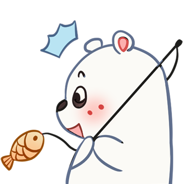

# 冬季北极熊

# 表情一览

|ID|名称|表情|源地址|修改时间|
|----|----|----|----|----|
|11085|[冬季北极熊_暗中观察]||[链接](https://i0.hdslb.com/bfs/emote/649efe14367133ff970d2964dfd12471b0cf19a9.png)|2022-12-02 16:07:34|
|11086|[冬季北极熊_比心]||[链接](https://i0.hdslb.com/bfs/emote/38c27b1a34d02fcd26aee45fb45b00519472582a.png)|2022-12-02 16:07:34|
|11087|[冬季北极熊_弹吉他]||[链接](https://i0.hdslb.com/bfs/emote/467925a4f64caba18774c5b9b2dafe7180b9a6b0.png)|2022-12-02 16:07:34|
|11088|[冬季北极熊_钓鱼]||[链接](https://i0.hdslb.com/bfs/emote/963a58179ee9bc92fbffefb74413bbe0ee8b677f.png)|2022-12-02 16:07:34|
|11089|[冬季北极熊_干杯]||[链接](https://i0.hdslb.com/bfs/emote/ae01fb275f1130920fa5588a1d2df64bad04af87.png)|2022-12-02 16:07:34|
|11090|[冬季北极熊_害羞]||[链接](https://i0.hdslb.com/bfs/emote/cf0c35fbaef56ce4a368cbbc2c1356ed9933b8f8.png)|2022-12-02 16:07:34|
|11091|[冬季北极熊_溜冰]||[链接](https://i0.hdslb.com/bfs/emote/c2dc8c2b95d405a6db5bb9852f1a9f077642d596.png)|2022-12-02 16:07:34|
|11092|[冬季北极熊_生气]||[链接](https://i0.hdslb.com/bfs/emote/adec43744166821599ff121ada98ac247fc6c1aa.png)|2022-12-02 16:07:34|
|11093|[冬季北极熊_晚安]||[链接](https://i0.hdslb.com/bfs/emote/f1185d7415573a5ed53e82091e47061ad2b3fa09.png)|2022-12-02 16:07:34|
|11094|[冬季北极熊_熊抱]||[链接](https://i0.hdslb.com/bfs/emote/798590762d0600555aa54626d317078509f37a25.png)|2022-12-02 16:07:34|

# 原始数据

[跳转](./raw.json)

