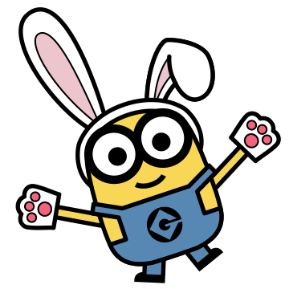

# 小黄人大眼萌

# 表情一览

|ID|名称|表情|源地址|修改时间|
|----|----|----|----|----|
|13858|[小黄人大眼萌_一起玩]||[链接](https://i0.hdslb.com/bfs/emote/90f904df8a6b52b4af706bbaed8291a81cd10266.png)|2023-02-09 18:56:13|
|13859|[小黄人大眼萌_好事花生]||[链接](https://i0.hdslb.com/bfs/emote/c17cbb05fa4a9600adc479391ece5d9fe058482e.png)|2023-02-09 18:56:13|
|13860|[小黄人大眼萌_恭喜发财]||[链接](https://i0.hdslb.com/bfs/emote/4c6d1899cbf5cd962d2488f37980dad6679a4d83.png)|2023-02-09 18:56:13|
|13861|[小黄人大眼萌_震惊]||[链接](https://i0.hdslb.com/bfs/emote/c0100408e68fe6e2b56ec6a086459139545bac7f.png)|2023-02-09 18:56:13|
|13862|[小黄人大眼萌_干的漂亮]||[链接](https://i0.hdslb.com/bfs/emote/d8f462fef7a18badda2e2cba21c18c61e1e575fd.png)|2023-02-09 18:56:13|
|13863|[小黄人大眼萌_可爱]||[链接](https://i0.hdslb.com/bfs/emote/e7acd7fd38c5f3a0f6d3bf0a09facdf2b1ea5f85.png)|2023-02-09 18:56:13|
|13864|[小黄人大眼萌_欢呼]||[链接](https://i0.hdslb.com/bfs/emote/1d59c8c5daa0b60d00227d0855d2d16ab64e10f2.png)|2023-02-09 18:56:13|
|13865|[小黄人大眼萌_开心]||[链接](https://i0.hdslb.com/bfs/emote/3b4ae8d8c2ff38db38bdc98067f060fb86dff860.png)|2023-02-09 18:56:13|
|13866|[小黄人大眼萌_你好]||[链接](https://i0.hdslb.com/bfs/emote/5a1e980a0cbfe39f8783e2def949215839fd55b4.png)|2023-02-09 18:56:13|
|13867|[小黄人大眼萌_想吃]||[链接](https://i0.hdslb.com/bfs/emote/1c6b392de3b9a3e769db1bda9f82f3f791243b67.png)|2023-02-09 18:56:13|

# 原始数据

[跳转](./raw.json)

