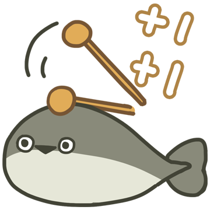

# 萨卡班甲鱼

# 表情一览

|ID|名称|表情|源地址|修改时间|
|----|----|----|----|----|
|34110|[萨卡班甲鱼_鱼头]||[链接](https://i0.hdslb.com/bfs/garb/4fd8846ab72270bc1bcdeb250cf3fdf6262bfeaa.png)|2023-06-22 13:34:10|
|34111|[萨卡班甲鱼_鱼身]||[链接](https://i0.hdslb.com/bfs/garb/e9a5076dbc811d70746c2a06f279e306649f2439.png)|2023-06-22 13:34:10|
|34112|[萨卡班甲鱼_鱼尾]||[链接](https://i0.hdslb.com/bfs/garb/9b59c7074bd27362bc33a705c5e046e648547f8d.png)|2023-06-22 13:34:10|
|34113|[萨卡班甲鱼_震惊]||[链接](https://i0.hdslb.com/bfs/garb/e43fd80a3065236ce30993af71a1bea7d28d3b68.png)|2023-06-22 13:34:10|
|34114|[萨卡班甲鱼_五头鱼]||[链接](https://i0.hdslb.com/bfs/garb/5d626026cdc69a922ffd0e287443c3a3c9461687.png)|2023-06-22 13:34:10|
|34115|[萨卡班甲鱼_凝视]||[链接](https://i0.hdslb.com/bfs/garb/195244a490dc038c31e9116c1b0a11930c3edca7.png)|2023-06-22 13:34:10|
|34116|[萨卡班甲鱼_嗯嗯]||[链接](https://i0.hdslb.com/bfs/garb/30b4fde6144f6be4eb31d849862f5c632f198d7d.png)|2023-06-22 13:34:10|
|34117|[萨卡班甲鱼_冷静]||[链接](https://i0.hdslb.com/bfs/garb/352dfb1ca6f6b1b9baf07d6fb0b0424446e0ca9e.png)|2023-06-22 13:34:10|
|34118|[萨卡班甲鱼_好耶]||[链接](https://i0.hdslb.com/bfs/garb/b1ded912a5a8e4fddaa672bbd1198bb1f510a41c.png)|2023-06-22 13:34:10|
|34119|[萨卡班甲鱼_疑问]||[链接](https://i0.hdslb.com/bfs/garb/4396fe63ec9c33bed1afe8d8f70280bfc63d46bd.png)|2023-06-22 13:34:10|
|34120|[萨卡班甲鱼_察觉]||[链接](https://i0.hdslb.com/bfs/garb/86414c0950d5e422dfce97154ee15816e8d0bf76.png)|2023-06-22 13:34:10|
|34121|[萨卡班甲鱼_爱心]||[链接](https://i0.hdslb.com/bfs/garb/5e64615ecfe21a4e9baf14298b747fd9261a7d96.png)|2023-06-22 13:34:10|
|34122|[萨卡班甲鱼_瘫倒]||[链接](https://i0.hdslb.com/bfs/garb/0bcd017d8eef93062015235392acacc083c902b1.png)|2023-06-22 13:34:10|
|34123|[萨卡班甲鱼_神！]||[链接](https://i0.hdslb.com/bfs/garb/e57a8fa662d2448507324cf56ba73365433afb6e.png)|2023-06-22 13:34:10|
|34124|[萨卡班甲鱼_阿巴阿巴]||[链接](https://i0.hdslb.com/bfs/garb/17dd08fee58af1263683b9fead266f6470baf949.png)|2023-06-22 13:34:10|
|34125|[萨卡班甲鱼_光速移动]||[链接](https://i0.hdslb.com/bfs/garb/6d5a2c754ad1870984cb32cf47b15861679469c2.png)|2023-06-22 13:34:10|
|34126|[萨卡班甲鱼_照镜子]||[链接](https://i0.hdslb.com/bfs/garb/3a3c3273a261d78e6a44b9caa7a9e5b15a87d427.png)|2023-06-22 13:34:10|
|34127|[萨卡班甲鱼_抛瓦]||[链接](https://i0.hdslb.com/bfs/garb/1764dcd240b9370ba4dc9d98370fc3f18b3d12cf.png)|2023-06-22 13:34:10|
|34128|[萨卡班甲鱼_功德增加]||[链接](https://i0.hdslb.com/bfs/garb/f374b991afd6a7cad08c19af31fb70bfa2c7be11.png)|2023-06-22 13:34:10|
|34129|[萨卡班甲鱼_星空]||[链接](https://i0.hdslb.com/bfs/garb/e8a18c97b071859a1ddc45260c8e91e06dc78204.png)|2023-06-22 13:34:10|

# 原始数据

[跳转](./raw.json)

