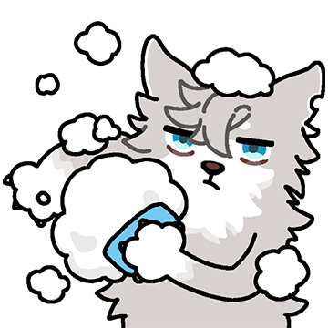

# 曾经黏人的狗狗

# 表情一览

|ID|名称|表情|源地址|修改时间|
|----|----|----|----|----|
|60393|[曾经黏人的狗狗_摸摸]||[链接](https://i0.hdslb.com/bfs/garb/c434687035d8795694e0426e452d342b63bf392d.png)|2024-01-15 14:34:30|
|60394|[曾经黏人的狗狗_禁止摸摸]||[链接](https://i0.hdslb.com/bfs/garb/f2595b10a222f47b3f5fff43e1c4d7df05abcb4b.png)|2024-01-15 14:34:30|
|60395|[曾经黏人的狗狗_宕机]||[链接](https://i0.hdslb.com/bfs/garb/8afc3d78b952d78caa1ec306798b94188782a4ba.png)|2024-01-15 14:34:30|
|60396|[曾经黏人的狗狗_崇拜]||[链接](https://i0.hdslb.com/bfs/garb/08b87c46ea2d00df1e317e1886bd0d1ec0c0c644.png)|2024-01-15 14:34:30|
|60397|[曾经黏人的狗狗_害羞]||[链接](https://i0.hdslb.com/bfs/garb/e43a24c041927aebf20be111e640841023ad142c.png)|2024-01-15 14:34:30|
|60398|[曾经黏人的狗狗_肉腿]||[链接](https://i0.hdslb.com/bfs/garb/c41a9454b6daaf0ef0714f8eac6b3a48da0d52bc.png)|2024-01-15 14:34:30|
|60399|[曾经黏人的狗狗_开心]||[链接](https://i0.hdslb.com/bfs/garb/3a7f17a9de8db4d7709ce6222c139747fee839bc.png)|2024-01-15 14:34:30|
|60400|[曾经黏人的狗狗_嫌弃]||[链接](https://i0.hdslb.com/bfs/garb/27ddcc05f55cf94cf8d900f102a94e0c26cafee8.png)|2024-01-15 14:34:30|
|60401|[曾经黏人的狗狗_耍赖]||[链接](https://i0.hdslb.com/bfs/garb/e2bdd0b10c1ec8cb35517edfbd902517e1f08d4e.png)|2024-01-15 14:34:30|
|60402|[曾经黏人的狗狗_哭哭]||[链接](https://i0.hdslb.com/bfs/garb/cfa813c41390219964512e3d19e5cec438ba78af.png)|2024-01-15 14:34:30|
|60403|[曾经黏人的狗狗_睡觉]||[链接](https://i0.hdslb.com/bfs/garb/b2e19e1803d0463c2d2771425ec4f11863f89229.png)|2024-01-15 14:34:30|
|60404|[曾经黏人的狗狗_沮丧]||[链接](https://i0.hdslb.com/bfs/garb/6741e0fdd8751387768e9fe6e2972bb6353115fd.png)|2024-01-15 14:34:30|
|60405|[曾经黏人的狗狗_有点生气]||[链接](https://i0.hdslb.com/bfs/garb/54e09916cad4d5bf99c7c0a573598ddf999b5720.png)|2024-01-15 14:34:30|
|60406|[曾经黏人的狗狗_搓澡]||[链接](https://i0.hdslb.com/bfs/garb/68822bd33cef7db7cdd463fe321cfd61af911202.png)|2024-01-15 14:34:30|
|60407|[曾经黏人的狗狗_无聊]||[链接](https://i0.hdslb.com/bfs/garb/9cfa9fc05fc2629f4a8c9d5dd7abc7c4024c12b9.png)|2024-01-15 14:34:30|

# 原始数据

[跳转](./raw.json)

