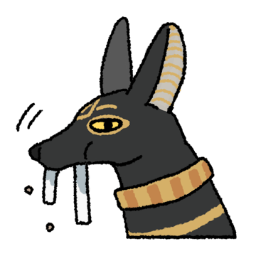

# 古埃及之神-阿努比斯

# 表情一览

|ID|名称|表情|源地址|修改时间|
|----|----|----|----|----|
|64867|[古埃及之神-阿努比斯_沉默]||[链接](https://i0.hdslb.com/bfs/garb/0acadc779ecfce659c6a7b4ba0dab9f0241a985d.png)|2024-02-21 22:24:50|
|64868|[古埃及之神-阿努比斯_祝福]||[链接](https://i0.hdslb.com/bfs/garb/075ecf15503697b9fb8312fa6c742cfa8f1cd736.png)|2024-02-21 22:24:50|
|64869|[古埃及之神-阿努比斯_吃掉]||[链接](https://i0.hdslb.com/bfs/garb/5c8ae34ba45fa6b79f2ef9b0fa72d6a13b2da365.png)|2024-02-21 22:24:50|
|64870|[古埃及之神-阿努比斯_展示]||[链接](https://i0.hdslb.com/bfs/garb/dd0ef903afba8d635b299f86c6ed881e82d1f333.png)|2024-02-21 22:24:50|
|64871|[古埃及之神-阿努比斯_捏捏]||[链接](https://i0.hdslb.com/bfs/garb/006e22747d5b7ec558c5ebbc6e836f444ecaea8e.png)|2024-02-21 22:24:50|
|64872|[古埃及之神-阿努比斯_跟我走]||[链接](https://i0.hdslb.com/bfs/garb/2012229230bade11af69e2a22084a4baa73d9bdf.png)|2024-02-21 22:24:50|
|64873|[古埃及之神-阿努比斯_站岗狗狗]||[链接](https://i0.hdslb.com/bfs/garb/6748d5431a6700626953b59ab09474419d2d2aff.png)|2024-02-21 22:24:50|
|64874|[古埃及之神-阿努比斯_等一下]||[链接](https://i0.hdslb.com/bfs/garb/9df82c377857538fb32e48bb2b2b60ca0f8592eb.png)|2024-02-21 22:24:50|
|64875|[古埃及之神-阿努比斯_助力转生]||[链接](https://i0.hdslb.com/bfs/garb/eb3319eacab8fecac791a158a6bf91c766581d53.png)|2024-02-21 22:24:50|
|64876|[古埃及之神-阿努比斯_不对劲]||[链接](https://i0.hdslb.com/bfs/garb/5da81e9de2b5334664ccdd955d43e7eba90506d5.png)|2024-02-21 22:24:50|
|64877|[古埃及之神-阿努比斯_累了]||[链接](https://i0.hdslb.com/bfs/garb/8dbe80b06669186ebf90ec9b5cd10f7a12a436fc.png)|2024-02-21 22:24:50|
|64878|[古埃及之神-阿努比斯_疑惑]||[链接](https://i0.hdslb.com/bfs/garb/4f11c5ec57582e9e579190552f5dfa3123b7a854.png)|2024-02-21 22:24:50|
|64879|[古埃及之神-阿努比斯_嗯嗯]||[链接](https://i0.hdslb.com/bfs/garb/35ab137f8ed0b37f6f73b42b74fcd9272d637e15.png)|2024-02-21 22:24:50|
|64880|[古埃及之神-阿努比斯_无动于衷]||[链接](https://i0.hdslb.com/bfs/garb/16778f7e0826d7db5e757a13faaf334d4920efdf.png)|2024-02-21 22:24:50|
|64881|[古埃及之神-阿努比斯_古埃及的神]||[链接](https://i0.hdslb.com/bfs/garb/f84811ca7fd33330634c41176bc4d40cdd524d0c.png)|2024-02-21 22:24:50|

# 原始数据

[跳转](./raw.json)

