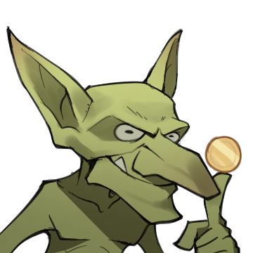

# 哥布林文学

# 表情一览

|ID|名称|表情|源地址|修改时间|
|----|----|----|----|----|
|70708|[哥布林文学_哥布林]||[链接](https://i0.hdslb.com/bfs/garb/b302ed6f15fa83ffd1a92371e74ed72d08ab8ce6.png)|2024-04-28 17:13:50|
|70709|[哥布林文学_烈焰哥布林]||[链接](https://i0.hdslb.com/bfs/garb/71d41844f935bbd8396f8ec8095825ce375a79a3.png)|2024-04-28 17:13:50|
|70710|[哥布林文学_冰霜哥布林]||[链接](https://i0.hdslb.com/bfs/garb/8e4917c6443de656760aeab13453427783675f6b.png)|2024-04-28 15:55:20|
|70711|[哥布林文学_暴风哥布林]||[链接](https://i0.hdslb.com/bfs/garb/6f9a84ab131607c41fcdfffbffa8cd305ed69cad.png)|2024-04-28 17:13:50|
|70712|[哥布林文学_阴暗哥布林]||[链接](https://i0.hdslb.com/bfs/garb/421dd219a00f3b16dccbef3eb8e05015236809c0.png)|2024-04-28 17:13:50|
|70713|[哥布林文学_淫邪哥布林]||[链接](https://i0.hdslb.com/bfs/garb/386fb5716928759aa936560348116db1ef47db5f.png)|2024-04-28 17:13:50|
|70714|[哥布林文学_暴食哥布林]||[链接](https://i0.hdslb.com/bfs/garb/13877db71cbb17c7c765ca65c36928397899f73e.png)|2024-04-28 17:13:50|
|70715|[哥布林文学_巨魔]||[链接](https://i0.hdslb.com/bfs/garb/99e49ba7266486cb8bec30039b3b714281abdadd.png)|2024-04-28 17:13:50|
|70716|[哥布林文学_笑]||[链接](https://i0.hdslb.com/bfs/garb/a53592c1c228d432fe3887e0610310611e1657e4.png)|2024-04-28 17:13:50|
|70717|[哥布林文学_生气]||[链接](https://i0.hdslb.com/bfs/garb/0f5086039f0fec1fed30c383c1057fcf69524be7.png)|2024-04-28 17:13:50|
|70718|[哥布林文学_照镜子]||[链接](https://i0.hdslb.com/bfs/garb/0e36eda5483f5ce71b873c1a6646554cb3a40f2b.png)|2024-04-28 17:13:50|
|70719|[哥布林文学_我没意见]||[链接](https://i0.hdslb.com/bfs/garb/85ed79768576276238581c7921675927f6641aa0.png)|2024-04-28 17:13:50|
|70720|[哥布林文学_惊吓]||[链接](https://i0.hdslb.com/bfs/garb/afaed5fd9b1732dc9162b2d2c5f32921da7d2112.png)|2024-04-28 17:13:50|
|70721|[哥布林文学_精灵]||[链接](https://i0.hdslb.com/bfs/garb/7f633a5df9fdbbd02c701b14302012a48282434c.png)|2024-04-28 17:13:50|
|70722|[哥布林文学_圣女]||[链接](https://i0.hdslb.com/bfs/garb/8ef821d753b8b9ed6b897d6e06268c7e719f5bf5.png)|2024-04-28 17:13:50|

# 原始数据

[跳转](./raw.json)

