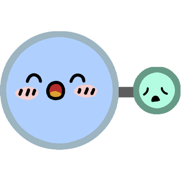

# CaO与他de朋友们

# 表情一览

|ID|名称|表情|源地址|修改时间|
|----|----|----|----|----|
|82039|[CaO与他de朋友们_SiO2]||[链接](https://i0.hdslb.com/bfs/garb/f3c624885ee944f049052a28ede3642412817c12.png)|2024-08-08 17:24:53|
|82040|[CaO与他de朋友们_CH4]||[链接](https://i0.hdslb.com/bfs/garb/f5ae2450fbad26786ac11ad382039e4a7d4191c2.png)|2024-08-08 11:55:00|
|82041|[CaO与他de朋友们_CaCO3]||[链接](https://i0.hdslb.com/bfs/garb/d634aa5855ecbfc92128f55196c7fca7ca45a6f3.png)|2024-08-08 11:55:00|
|82042|[CaO与他de朋友们_H2O2]||[链接](https://i0.hdslb.com/bfs/garb/17134a989c3393c0fa57a169dc28794eb64e2b64.png)|2024-08-08 11:55:00|
|82043|[CaO与他de朋友们_CaCl2]||[链接](https://i0.hdslb.com/bfs/garb/6234933ca28c941b14540c5755738156f5660573.png)|2024-08-08 11:55:00|
|82044|[CaO与他de朋友们_O2]||[链接](https://i0.hdslb.com/bfs/garb/599e6dfcc2600c7175f4deca75d8633761980a1a.png)|2024-08-08 11:55:00|
|82045|[CaO与他de朋友们_C2H5OH]||[链接](https://i0.hdslb.com/bfs/garb/8e8769c3f89c303c8801b52f9005268280c270db.png)|2024-08-08 11:55:00|
|82046|[CaO与他de朋友们_HCl]||[链接](https://i0.hdslb.com/bfs/garb/19c171c150e134b1cef6674986a282fa80a67f33.png)|2024-08-08 11:55:00|
|82047|[CaO与他de朋友们_NaOH]||[链接](https://i0.hdslb.com/bfs/garb/e8840ada37c261e71590ad52fe39008540eff6be.png)|2024-08-08 11:55:00|
|82048|[CaO与他de朋友们_SO2]||[链接](https://i0.hdslb.com/bfs/garb/4cd6814ce8aba368550184fac6bfd8a1a4866f82.png)|2024-08-08 11:55:00|
|82049|[CaO与他de朋友们_CO]||[链接](https://i0.hdslb.com/bfs/garb/6ebe2688d2330e712061086f25dd9ceed08eab05.png)|2024-08-08 11:55:00|
|82050|[CaO与他de朋友们_CO2]||[链接](https://i0.hdslb.com/bfs/garb/8965705420a5cae891fa2f5b0d5e8fdfe3bd8001.png)|2024-08-08 11:55:00|
|82051|[CaO与他de朋友们_NaCl]||[链接](https://i0.hdslb.com/bfs/garb/34934439d88aadb28683060c33279bf6343e7538.png)|2024-08-08 11:55:00|
|82052|[CaO与他de朋友们_H2O]||[链接](https://i0.hdslb.com/bfs/garb/84151b2000e5050576b2eb5ee161593d7f4d87cd.png)|2024-08-08 11:55:00|
|82053|[CaO与他de朋友们_CaO]||[链接](https://i0.hdslb.com/bfs/garb/98402eb37548d6a0075a9d0e7d5fa7e0ca7caa0b.png)|2024-08-08 11:55:00|

# 原始数据

[跳转](./raw.json)

