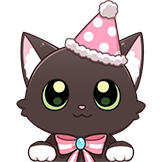

# 吉祥物表情包

# 表情一览

|ID|名称|表情|源地址|修改时间|
|----|----|----|----|----|
|99521|[吉祥物表情包_正面]||[链接](https://i0.hdslb.com/bfs/emote/a97bb91c3ab41b17fe8b20ff14105f61c2c53d44.png)|2025-01-03 14:09:19|
|99522|[吉祥物表情包_开心]||[链接](https://i0.hdslb.com/bfs/emote/9a23452ba8917f1539f9e132ea81f7a9ac814e90.png)|2025-01-03 14:09:19|
|99523|[吉祥物表情包_好奇]||[链接](https://i0.hdslb.com/bfs/emote/d1a5837f276a10dac42f843ec0e487224ca70855.png)|2025-01-03 14:09:19|
|99524|[吉祥物表情包_捏]||[链接](https://i0.hdslb.com/bfs/emote/6fbfb70202a06efddbee2039aa84066fc11f0d0d.png)|2025-01-03 14:09:19|
|99525|[吉祥物表情包_害羞]||[链接](https://i0.hdslb.com/bfs/emote/3ec5e13e4305ec018e60c55594b11d622da4e1d9.png)|2025-01-03 14:09:19|
|99526|[吉祥物表情包_乱跳]||[链接](https://i0.hdslb.com/bfs/emote/4acb3474f2927ab425f3a6a9e19fbbb50c3f9d86.png)|2025-01-03 14:09:19|
|99527|[吉祥物表情包_祝福]||[链接](https://i0.hdslb.com/bfs/emote/5b1a2542ac106f22d3008b189dc7884f0b2d40b1.png)|2025-01-03 14:09:19|
|99528|[吉祥物表情包_OK]||[链接](https://i0.hdslb.com/bfs/emote/dd72b1a7ad3e7fda2f33a50701aef72fb1205408.png)|2025-01-03 14:09:19|
|99529|[吉祥物表情包_收到]||[链接](https://i0.hdslb.com/bfs/emote/80970959f8b058a39f982fa11b7d23644abe5a03.png)|2025-01-03 14:09:19|
|99530|[吉祥物表情包_庆祝]||[链接](https://i0.hdslb.com/bfs/emote/e59f54c7ff5b2d59a71663d0b5c9a2b729cb0156.png)|2025-01-03 14:09:00|

# 原始数据

[跳转](./raw.json)

