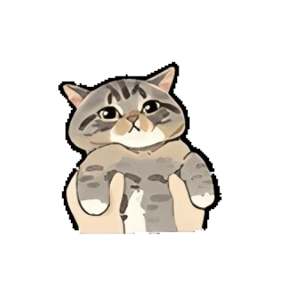

# 养猫的人

# 表情一览

|ID|名称|表情|源地址|修改时间|
|----|----|----|----|----|
|104011|[养猫的人_啊？]||[链接](https://i0.hdslb.com/bfs/garb/80036a9a2494362724c003194f4b97d909c857c2.png)|2025-02-13 18:00:00|
|104012|[养猫的人_呆住喵]||[链接](https://i0.hdslb.com/bfs/garb/c9b978d4627847253541e6f595042d08590e92f5.png)|2025-02-06 17:01:00|
|104013|[养猫的人_红包拿来]||[链接](https://i0.hdslb.com/bfs/garb/3e824b6806072d70a0199f0fb50e2ef4d7d42b20.png)|2025-02-13 18:00:00|
|104014|[养猫的人_摸猫头]||[链接](https://i0.hdslb.com/bfs/garb/023a531dfd18597130d8e36959bc153a58b28e9c.png)|2025-02-06 17:01:00|
|104015|[养猫的人_托起喵]||[链接](https://i0.hdslb.com/bfs/garb/45ef5e3dff83bcc43d266980408ac35a574eb852.png)|2025-02-06 17:01:00|
|104016|[养猫的人_托手手]||[链接](https://i0.hdslb.com/bfs/garb/f6374a79449893838f92469e8ba28d446279d273.png)|2025-02-06 17:01:00|
|104017|[养猫的人_好困喵]||[链接](https://i0.hdslb.com/bfs/garb/116fb8225d7d2e61cf06e254744c71d42f3ab804.png)|2025-02-06 17:01:00|
|104018|[养猫的人_捏喵]||[链接](https://i0.hdslb.com/bfs/garb/5e226160a120df533923319dd92c4016b30cb3a7.png)|2025-02-06 18:00:00|
|104019|[养猫的人_委屈喵]||[链接](https://i0.hdslb.com/bfs/garb/4e83504d258c7db127ae8544366e14f62fcecca5.png)|2025-02-06 17:01:00|
|104020|[养猫的人_伸懒腰]||[链接](https://i0.hdslb.com/bfs/garb/753d019883ad57d1e71a84c5e065f6e3002fd096.png)|2025-02-06 17:01:00|
|104021|[养猫的人_卡住喵]||[链接](https://i0.hdslb.com/bfs/garb/2cf8263fcf9aa5d502e34dde361af1f265f0f084.png)|2025-02-06 17:01:00|
|104022|[养猫的人_抱起喵]||[链接](https://i0.hdslb.com/bfs/garb/426998b71dc1878039734ef4ba3905af3e9e68bb.png)|2025-02-06 17:01:00|
|104023|[养猫的人_瞪大眼]||[链接](https://i0.hdslb.com/bfs/garb/736624c2f877ffaeba843baf929d647a81b15f37.png)|2025-02-06 17:01:00|
|104024|[养猫的人_小馋喵]||[链接](https://i0.hdslb.com/bfs/garb/c7c58d9f33171c9368db7002b61abcc32329794f.png)|2025-02-06 17:01:00|
|104025|[养猫的人_摁住喵]||[链接](https://i0.hdslb.com/bfs/garb/00bc09c2e4c25f83c443e21754ad55573986fc27.png)|2025-02-06 17:01:00|
|104026|[养猫的人_一条喵]||[链接](https://i0.hdslb.com/bfs/garb/5692ec2e866b19c76f37b7eaf59d645cb244f3e8.png)|2025-02-06 17:01:00|
|104027|[养猫的人_帅气喵]||[链接](https://i0.hdslb.com/bfs/garb/53fd0ec9bff8a406ccd15bf5dc7e85048b75c3ea.png)|2025-02-06 17:01:00|
|104028|[养猫的人_舔喵]||[链接](https://i0.hdslb.com/bfs/garb/bc072421c89cb63a0e69ab515e9e81a23512db2b.png)|2025-02-06 17:01:00|
|104029|[养猫的人_击掌喵]||[链接](https://i0.hdslb.com/bfs/garb/9b2608c88e9daadf46e5868db7c126eb28193eee.png)|2025-02-06 17:01:00|
|104030|[养猫的人_愣住喵]||[链接](https://i0.hdslb.com/bfs/garb/32807a24a94f9b9bbece2adf72ae136745d3e6d0.png)|2025-02-06 17:01:00|

# 原始数据

[跳转](./raw.json)

