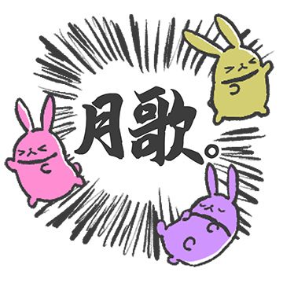

# TSUKIUTA.

# 表情一览

|ID|名称|表情|源地址|修改时间|
|----|----|----|----|----|
|108687|[TSUKIUTA._开始咯]||[链接](https://i0.hdslb.com/bfs/garb/c17107aa71e884ee394d980e7f88830ad40f1ed3.png)|2025-04-14 19:01:00|
|108688|[TSUKIUTA._约好了]||[链接](https://i0.hdslb.com/bfs/garb/3dedb0b11891f51d16f695eb33a41baa3e9f6943.png)|2025-04-14 19:01:00|
|108689|[TSUKIUTA._加油]||[链接](https://i0.hdslb.com/bfs/garb/d58dbeebff1c291d33eee1fb724c1914ee63998e.png)|2025-04-14 19:01:00|
|108690|[TSUKIUTA._谢谢]||[链接](https://i0.hdslb.com/bfs/garb/13aa163b6c0ff0c465ba42cea895fcfb9cf96494.png)|2025-04-14 19:01:00|
|108691|[TSUKIUTA._来了来了]||[链接](https://i0.hdslb.com/bfs/garb/e2646cd865aa6fa2384b8776be556c8aeb2e8033.png)|2025-04-14 19:01:00|
|108692|[TSUKIUTA._得意]||[链接](https://i0.hdslb.com/bfs/garb/41338d535a7b30ff3d2df95445a91de989bbbd56.png)|2025-04-14 19:01:00|
|108693|[TSUKIUTA._但是我拒绝]||[链接](https://i0.hdslb.com/bfs/garb/8170b2a9dc42b0126cb44b4f86a3e2d599464120.png)|2025-04-14 19:01:00|
|108694|[TSUKIUTA._好厉害]||[链接](https://i0.hdslb.com/bfs/garb/1fa618cf2801a51d5836a5d8cc3da5c084275d7b.png)|2025-04-14 19:01:00|
|108695|[TSUKIUTA._不错嘛]||[链接](https://i0.hdslb.com/bfs/garb/cab371c14bc406d7ad4222585f9f7c3df7f731c1.png)|2025-04-14 19:01:00|
|108696|[TSUKIUTA._？]||[链接](https://i0.hdslb.com/bfs/garb/3a56fbf7ba6a07b86df2ed9fb58f3d33aeed2416.png)|2025-04-14 19:01:00|
|108697|[TSUKIUTA._拜托啦]||[链接](https://i0.hdslb.com/bfs/garb/3b0796105c5f5ab2082c6fe6624718aedc928d3c.png)|2025-04-14 19:01:00|
|108698|[TSUKIUTA._贵安]||[链接](https://i0.hdslb.com/bfs/garb/40f8a3133254d8996b8fdcc78e19f14b91b3ca81.png)|2025-04-14 19:01:00|
|108699|[TSUKIUTA._等你联络]||[链接](https://i0.hdslb.com/bfs/garb/3cc980e03b84650b93353da47ffe57f58aff5ac1.png)|2025-04-14 19:01:00|
|108700|[TSUKIUTA._该认真了]||[链接](https://i0.hdslb.com/bfs/garb/d8bb4b7197d83c58c8bcd9c34b49289ffb9c59b7.png)|2025-04-14 19:01:00|
|108701|[TSUKIUTA._...]||[链接](https://i0.hdslb.com/bfs/garb/fbf3b8a113f57b1156a9c50d83b1a76d67366ac0.png)|2025-04-14 19:01:00|
|108702|[TSUKIUTA._盯]||[链接](https://i0.hdslb.com/bfs/garb/110e4f8c6db85e2bd4df2580eaa297cd036f3e17.png)|2025-04-14 19:01:00|
|108703|[TSUKIUTA._当选祈愿]||[链接](https://i0.hdslb.com/bfs/garb/0c1623a8f9058f1ad230e5ce04733e5e72009856.png)|2025-04-14 19:01:00|
|108704|[TSUKIUTA._神]||[链接](https://i0.hdslb.com/bfs/garb/898a672492a1c1c3e47ab386cf0c01abd419be99.png)|2025-04-14 19:01:00|
|108705|[TSUKIUTA._大感谢祭]||[链接](https://i0.hdslb.com/bfs/garb/98c8a3564302105ea07c438bdb5b411b435828d8.png)|2025-04-14 19:01:00|
|108706|[TSUKIUTA._尊了尊了]||[链接](https://i0.hdslb.com/bfs/garb/e8d0ec96953242dfc26dcf5104a1f10278956a4f.png)|2025-04-14 19:01:00|

# 原始数据

[跳转](./raw.json)

