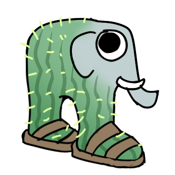

# 抽象山海经

# 表情一览

|ID|名称|表情|源地址|修改时间|
|----|----|----|----|----|
|109764|[抽象山海经_耐氪鲨鱼]||[链接](https://i0.hdslb.com/bfs/garb/d66a6615320c996d80c33be44f06e3edc86da71c.png)|2025-04-28 11:13:50|
|109765|[抽象山海经_鳄鱼轰炸机]||[链接](https://i0.hdslb.com/bfs/garb/ec2ef67adeeb60a551b32b0a8710bcd174738104.png)|2025-04-28 11:13:50|
|109766|[抽象山海经_咖啡忍者]||[链接](https://i0.hdslb.com/bfs/garb/0a4d6fd141bdc7b2616f2651fbf9a5528fbd650e.png)|2025-04-28 11:13:50|
|109767|[抽象山海经_鹅式轰炸机]||[链接](https://i0.hdslb.com/bfs/garb/3f167b31e7843bb0eb7fd4cd6f6a27ed2b343e72.png)|2025-04-28 11:13:50|
|109768|[抽象山海经_猫鱼]||[链接](https://i0.hdslb.com/bfs/garb/e0d0d10858217bfd1361ac7f3f8b328535d16b5e.png)|2025-04-28 11:13:50|
|109769|[抽象山海经_草莓骑士]||[链接](https://i0.hdslb.com/bfs/garb/541bcd8607755a3e768ea0ae06b4e70a22efcb4e.png)|2025-04-28 11:13:50|
|109770|[抽象山海经_茸茸章鱼]||[链接](https://i0.hdslb.com/bfs/garb/55dad5528ace6e00dc8ec807c532e2728717e682.png)|2025-04-28 11:13:50|
|109771|[抽象山海经_轮胎蛙]||[链接](https://i0.hdslb.com/bfs/garb/96e791cc27fbb47d6291d83932581f8b12599fcd.png)|2025-04-28 11:13:50|
|109772|[抽象山海经_仙人象]||[链接](https://i0.hdslb.com/bfs/garb/573d1c98e2d6f60189b52d9b836fe222821c261b.png)|2025-04-28 11:13:50|
|109773|[抽象山海经_大脚怪]||[链接](https://i0.hdslb.com/bfs/garb/f19c657720f78a6eb9a0dbeead7453d6fec45ebe.png)|2025-04-28 11:13:50|
|109774|[抽象山海经_木棍人]||[链接](https://i0.hdslb.com/bfs/garb/b436015c6ff9f3c89496c3a614119ea6cd05d90a.png)|2025-04-28 11:13:50|
|109775|[抽象山海经_卡皮巴椰]||[链接](https://i0.hdslb.com/bfs/garb/b915b7032425757f917076536a70240b7cc5dbc5.png)|2025-04-28 11:13:50|
|109776|[抽象山海经_星球奶牛]||[链接](https://i0.hdslb.com/bfs/garb/313e8b2d9c751ea0c48d1eb93ac7089ace1267b6.png)|2025-04-28 11:13:50|
|109777|[抽象山海经_香蕉猴]||[链接](https://i0.hdslb.com/bfs/garb/a759cf3aafb3d684535e2b17e1c5826e2850e0e5.png)|2025-04-28 11:13:50|
|109778|[抽象山海经_西瓜斑马]||[链接](https://i0.hdslb.com/bfs/garb/325cc5cd5a72c399e418552e904128d07b9e8dc3.png)|2025-04-28 11:13:50|

# 原始数据

[跳转](./raw.json)

